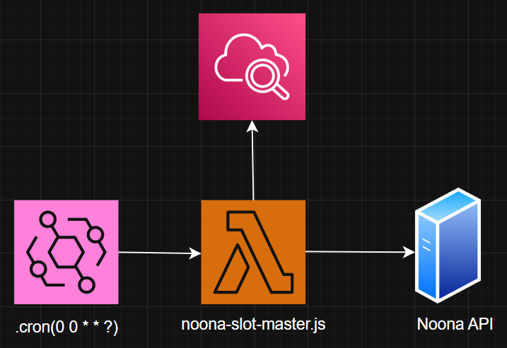

## Overview
NoonaSlotMaster is an automated booking assistant for the Noona platform. It finds available appointment slots based on your preferences and books them for you. You can choose a specific company, service, employee, time, and spacing between bookings. The script works continuously, checking as many months ahead as you configure, so you never miss a slot.

## Table of Contents
- [Overview](#overview)
- [Key Features](#key-features)
- [Why This Matters](#why-this-matters)
- [Configuration](#configuration)
- [AWS Serverless Architecture](#aws-serverless-architecture)
  - [Architecture Components](#architecture-components)
  - [Why This Architecture?](#why-this-architecture)

## Key Features

- **Automated Slot Search**: Scans available time slots for a specific company, employee, and service.  
- **Custom Scheduling**: Books appointments only on your preferred day of the week and time.  
- **Customer Info Integration**: Automatically fills in your personal details when booking.  
- **Booking Frequency Control**: Honors a number of days between appointments to prevent overbooking.
- **Configurable Availability Window**: Check as many months ahead as you like by adjusting a single config value.  
- **Automated Daily Execution**: Can be scheduled to run automatically every day, ensuring the best chance to secure slots.  


## Why This Matters

- **Never Miss a Slot**: Be first in line when new appointments open.  
- **Fully Automated**: Works while you sleep, no manual checking required.  
- **Reliable Scheduling**: Avoid overlapping or too frequent bookings with built-in spacing logic.  
- **Time-Saving**: Reduces repetitive tasks and streamlines appointment management.  


## Configuration
Before running the script, configure the `CONFIG` object in your script:

```javascript
const CONFIG = {
  API_KEY: "your_api_key",
  COMPANY_ID: "company_id",
  EMPLOYEE_ID: "employee_id",
  EVENT_TYPE_ID: "event_type_id",
  START_DATE: "YYYY-MM-DD",
  DAY_OF_WEEK: 0-6,
  DESIRED_TIME: "HH:MM",
  MONTHS_AHEAD: 3,
  DAYS_BETWEEN_BOOKINGS: 14,
  CUSTOMER: {
    name: "Your Name",
    email: "your@email.com",
    phone: { code: "country_code", number: "phone_number" }
  }
};
```
**API_KEY**  
Your Noona API key to authenticate with the platform.

**COMPANY_ID**  
Unique ID of the company where you want to book appointments.

**EMPLOYEE_ID**  
ID of the employee you want to book with.

**EVENT_TYPE_ID**  
ID of the type of appointment/service you want to book.

**START_DATE**  
Earliest date to start searching for available slots.  
Format: `YYYY-MM-DD` (e.g., "2025-08-16").

**DAY_OF_WEEK**  
Preferred day(s) of the week for the booking.  
0 = Sunday, 1 = Monday, ..., 6 = Saturday.

**DESIRED_TIME**  
Preferred time for the appointment in `HH:MM` 24-hour format (e.g., "14:30").

**MONTHS_AHEAD**  
How many months ahead the script should look for slots (e.g., `3` = next 3 months).  
Note: Some companies restrict booking availability to a shorter window (often only **1 month ahead**).  
If you set a higher value than allowed, the script will still work, but the API will simply return no slots beyond the company’s limit.

**DAYS_BETWEEN_BOOKINGS**  
Number of days between bookings to prevent overbooking.

**CUSTOMER**  
Details of the customer for whom the appointment is booked:  
- **name** – Full name of the customer.  
- **email** – Customer’s email for confirmation.  
- **phone** – Object containing:  
  - **code** – Country code (e.g., "351" for PT)  
  - **number** – Phone number without the country code

## AWS Serverless Architecture


I use a simple yet powerful AWS serverless architecture that runs automatically every day, taking full advantage of AWS's free tier offerings:


### Architecture Components

1. **Amazon EventBridge**
   - Serverless scheduler that triggers the function daily at midnight UTC
   - Uses cron expression: `cron(0 0 * * ? *)` (runs at 00:00 UTC every day)

2. **AWS Lambda**
   - Runs the NoonaSlotMaster script in a serverless environment

3. **Noona API**
   - External service that provides availability data and handles bookings
   - Called by the Lambda function to find and reserve slots

4. **Amazon CloudWatch** 
   - Provides logging and monitoring for the Lambda function
   - Tracks execution history, performance metrics, and errors

### Why This Architecture?

- **100% Serverless**: No servers to manage, patch, or maintain
- **Cost Effective**: Runs entirely within AWS Free Tier limits 
- **Highly Available**: Built on AWS's global infrastructure with 99.9% uptime
- **Automatically Scalable**: Handles any load without configuration changes (not needed in this case)
- **Fully Managed**: AWS handles all infrastructure management
- **Secure**: Built-in security with IAM roles and encryption
